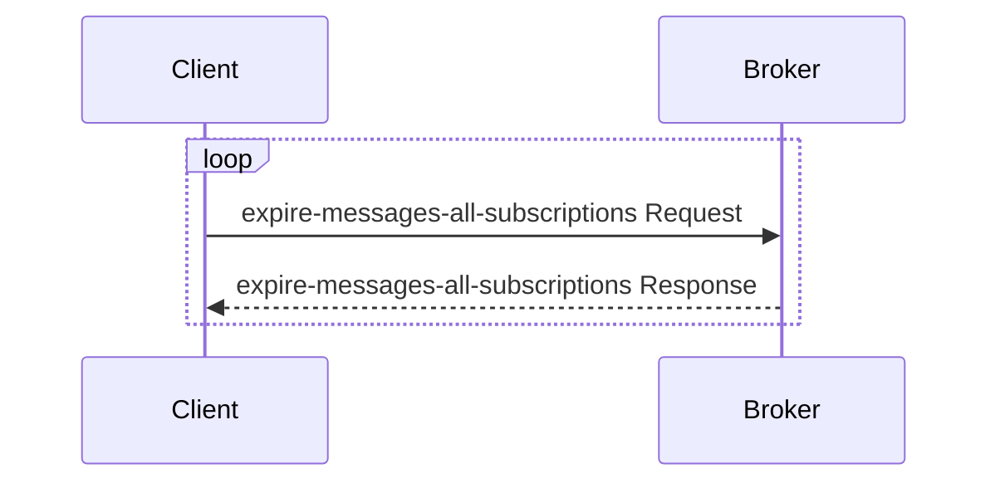
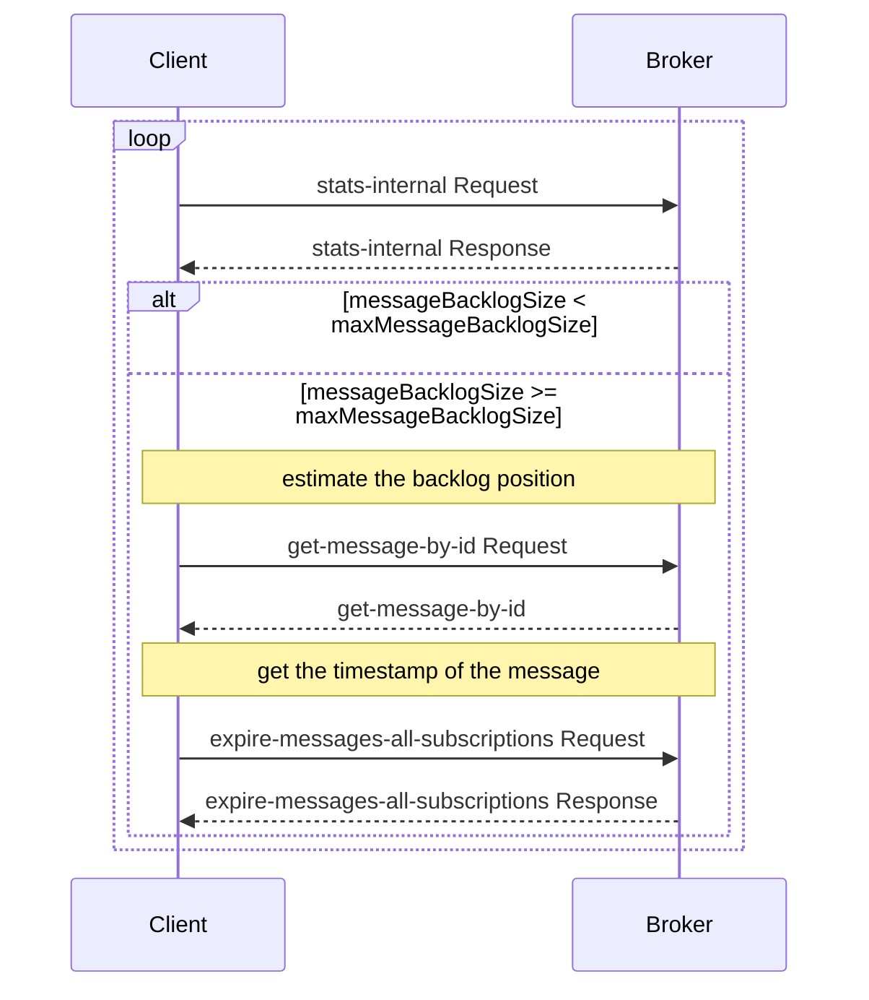

`Pulsar`像大多数消息中间件一样,支持按时间和大小对消息积压进行老化。但是默认的策略只能在namespace级别配置。本文将介绍如何在topic级别实现老化策略的两种方案。

## 方案一：开启 TopicLevelPolicy 来实现

默认的策略配置通过在`Zookeeper`上配置对应的策略，可以通过`./pulsar zookeeper-shell`命令来登录zookeeper集群查询。但是如果将这一实现方式扩展到topic级别，将会产生大量的（百万、千万级别）的ZooKeeper节点，这对于`ZooKeeper`集群来说几乎是不可接受的。因此，Pulsar提供了一种新的实现方式，即通过`Topic`来存储策略配置，而不是通过`ZooKeeper`来存储。

`Pulsar`，从2.7.0版本开始，引入了`SystemTopic`，用于存储`Topic`的元数据信息，包括`Topic`的策略配置。主题级策略使用户可以更灵活地管理主题,并不会给 ZooKeeper 带来额外负担。

您可以通过如下配置来开启`TopicLevelPolicy`：

```
systemTopicEnabled=true
topicLevelPoliciesEnabled=true
```

然后通过`set-backlog-quota`命令来设置您想要的老化时间和老化大小

PS: 完整的一些功能，如命令行`set-backlog-quota`，在3.0.0版本中支持

## 方案二：通过自定义代码来实现

`Pulsar`的`TopicLevelPolicy`实现需要通过topic存储策略配置，而不是通过`ZooKeeper`来存储。在实际的极端场景下，`Topic`中存储的内容可能会丢失（因为未开启`Bookkeeper`立即落盘或磁盘文件损坏等原因），这将导致策略配置丢失，从而导致策略失效。因此，我们可以通过自定义代码来实现topic级别的策略配置，这样可以避免策略配置丢失的问题。

举个例子，业务可以将策略存放在`Mysql`中，然后通过`Pulsar`的`Admin API`来让策略生效

### 自定义代码实现Backlog时间策略



### 自定义代码实现Backlog大小策略


