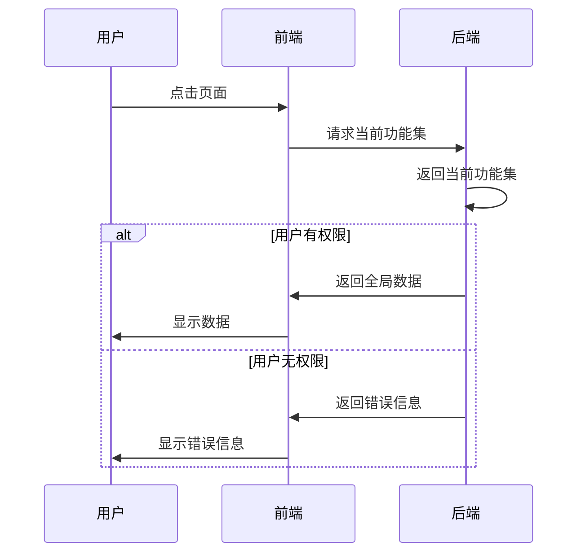
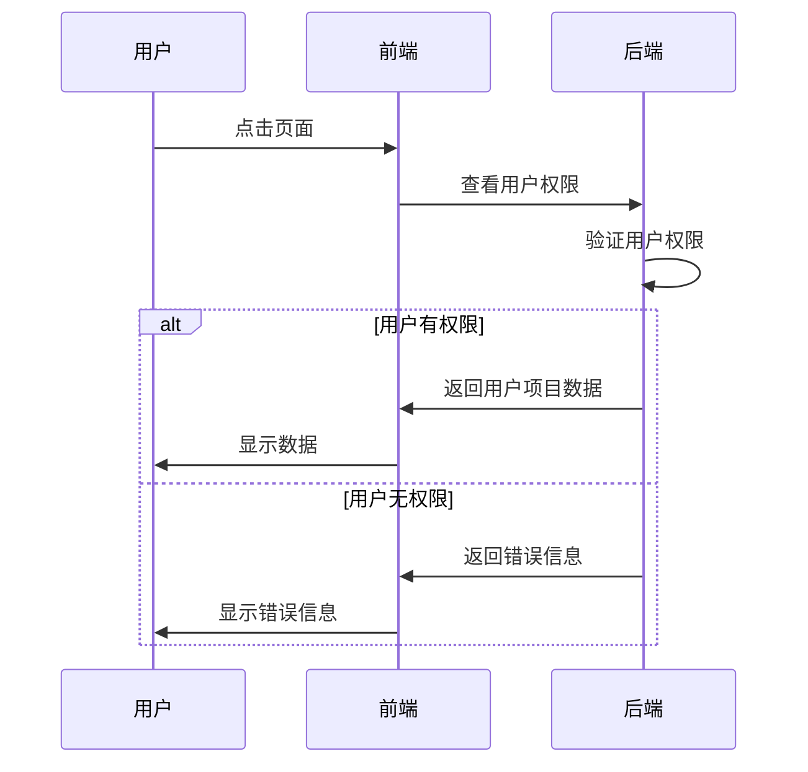

## SaaS服务全局级别的功能

前端调用SaaS服务一个全局级别的接口

```mermaid
sequenceDiagram
    participant User as 用户
    participant Frontend as 前端
    participant Backend as 后端

    User->>Frontend: 点击页面
    Frontend->>Backend: 请求当前功能集
    Backend->>Backend: 返回当前功能集
    alt 用户有权限
        Backend->>Frontend: 返回全局数据
        Frontend->>User: 显示数据
    else 用户无权限
        Backend->>Frontend: 返回错误信息
        Frontend->>User: 显示错误信息
    end
```

## SaaS服务用户级别的功能

前端调用SaaS服务一个用户权限的接口

```mermaid
sequenceDiagram
    participant User as 用户
    participant Frontend as 前端
    participant Backend as 后端

    User->>Frontend: 点击页面
    Frontend->>Backend: 查看用户权限
    Backend->>Backend: 验证用户权限
    alt 用户有权限
        Backend->>Frontend: 返回用户项目数据
        Frontend->>User: 显示数据
    else 用户无权限
        Backend->>Frontend: 返回错误信息
        Frontend->>User: 显示错误信息
    end
```
