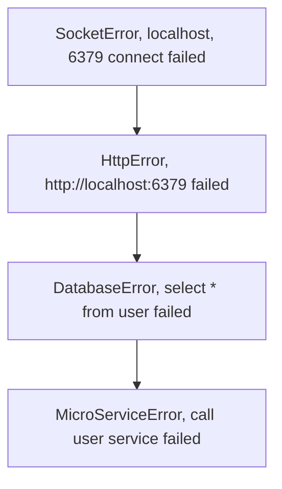

在软件开发中，健壮的异常处理是编写高质量代码的关键。本文将探讨现代编程语言中的通用异常处理方法，帮助你优雅地处理异常并写出健壮的代码。我们将不拘泥于某种语言，而是讨论一些普遍适用的策略。

# 异常链概述

现代编程语言通常将异常视为一条单向链表，链表中的节点包含根本原因和相关的上下文信息。例如：



异常就这么向外传播也不错，但是抽象是会泄露的，正常的时候顺风顺水，异常就需要判断一下，比如一个很常见的需求，文件已存在异常，就当做成功处理，用Java来写就是这样

```java
if (exception instanceof FileAlreadyExistsException) {
    log.info("file already exists");
    return SUCCESS;
}
throw exception;// or wrap it
```

综上来看，我们对现代编程语言的需求就是，能组织异常链，判断异常是否是某类异常，把异常用字符串的形式打印出来。

当我们在构筑一个library的时候，应该尽可能保持完整的异常链，除非你认为这个异常在library内可以处理，比如上面的情况。并且应该在项目的README，或者项目的某个文件中，详细地列出本library可能抛出的异常，以及异常的含义。

我们在`opengemini-client-go`中就有这样的例子，我们在`errors.go`中定义了所有可能的异常，以及异常的含义。

有些时候，我们构筑的不是library，出于隐藏内部实现或者是向终端用户隐藏逻辑上的低级错误，我们会对异常进行处理，比如常见的

```java
if (exception instanceof DuplicateKeyException) {
    log.info("duplicate key");
    return new ServiceException("already exists");
}
// many if else
throw new ServiceException("unknown error"); // or just internal error
```

题外话，由于Java只能判断本级的异常类型，你会经常看到`getCause`的代码，比如Apache Pulsar项目中的
```java
if (exception.getCause() != null
                    && exception.getCause() instanceof PulsarClientException.InvalidServiceURL) {
    throw new MalformedURLException(exception.getMessage());
}
```
包括层次一多，甚至可以看到递归代码
```java
private static Throwable mapToBkException(Throwable ex) {
        if (ex instanceof CompletionException || ex instanceof ExecutionException) {
            return mapToBkException(ex.getCause());
        }

        if (ex instanceof MetadataStoreException.NotFoundException) {
            BKException bke = BKException.create(BKException.Code.NoSuchLedgerExistsOnMetadataServerException);
            bke.initCause(ex);
            return bke;
        } else if (ex instanceof MetadataStoreException.AlreadyExistsException) {
            BKException bke = BKException.create(BKException.Code.LedgerExistException);
            bke.initCause(ex);
            return bke;
        } else if (ex instanceof MetadataStoreException.BadVersionException) {
            BKException bke = BKException.create(BKException.Code.MetadataVersionException);
            bke.initCause(ex);
            return bke;
        } else if (ex instanceof MetadataStoreException.AlreadyClosedException) {
            BKException bke = BKException.create(BKException.Code.LedgerClosedException);
            bke.initCause(ex);
            return bke;
        }

        return ex;
    }
```

Go在这里易用性做的不错，支持了`errors.Is`和`errors.As`，可以判断异常链中是否包含某个异常，也可以直接获取异常链中的异常。不过如果异常链里面有两个一模一样类型的异常，你想精准取到其中一个就比较困难，不过这在实际场景中非常少见。

这里，我们说异常链发生了变更，那么什么时候打印日志也比较明确了，当异常链发生变更的时候打印，保证完整的堆栈信息用于问题分析。这也可以保证在一条链的过程中，有且仅有一次打印日志。

在异常链发生终止，比如转化为http content，或者是print到console的时候，要不要打印日志呢？这个问题有些见人见智，这取决于你的用户在report问题的时候，会不会携带http content或者是console output，如果不会，那么你就需要打印日志，如果会，那么你就不需要打印日志。

Java里面，比起将底层的error抛出，我们更倾向于定义一个符合本library抽象层级的异常，并在方法的签名中只返回这个异常，一方面使得下层library的异常如果发生变化，本library依然是编译兼容的，另一方面也更符合抽象层级。

但是在Go里面，事情就更复杂一些，我愿意称之为类型的细化具备传染性，一旦你将某个方法的签名不返回interface，而是返回一个具体的类型，比如

```go
func (c *Client) CallService() (Result, *ServiceError) {
    if failed {
        return nil, &ServiceError{Code: 500, Message: "service error"}
    }
    return result, nil
}
```

然后有一个方法调用了它

```go
func main() {
    err := MakeFriend()
    if err != nil {
        panic(err)
    }
}

func (c *Client) MakeFriend() (Result, error) {
    err := io.Read("friend_list.txt")
    if err != nil {
        return nil, err
    }
    return CallService()    
```

这下就麻烦了，当*ServiceError转化为error, nil的ServiceError指针转化为error的时候就不是nil了，这很致命，是的，这非常致命。即使CallService()成功了，main函数还是会panic。

把这个叫做传染性还是比较准确的，异步的代码、鸿蒙的ets都具备一样的性质，他们会不断向上传播，我对这个词还是比较满意。

综上，Go里面，我们可以构筑具体的异常，但是在不能确保上层一直都是用这个细化类型的情况下，接口还是返回error interface。

漫谈了许多，我简单做一个总结
- 现代编程语言的异常是一条链
- 现代编程语言应该具备构筑异常链，判断异常是否是某类异常，异常打印的能力
- 设计符合抽象层级的异常
- 构筑一个library的时候，尽可能保持完整的异常链，在项目的README，或者项目的某个文件中，详细地列出本library可能抛出的异常，以及异常的含义
- 在异常链发生变更的时候进行日志打印
