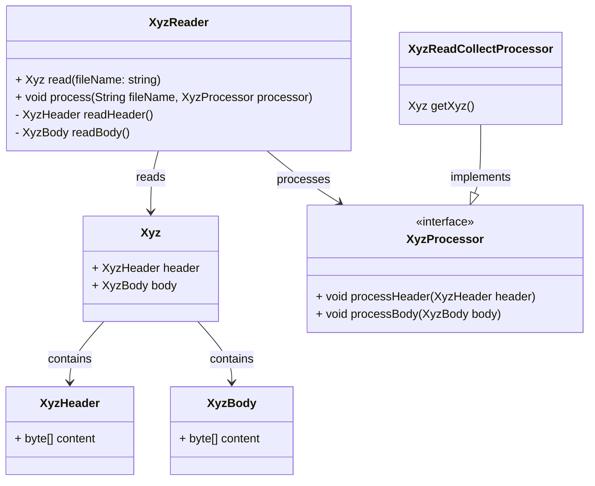

<!-- toc -->

# 概述

我们以xyz文件格式为例，来说明文件编解码的代码设计。xyz文件格式内容如下：

- header部分：文件头，包含文件版本号、文件类型、文件大小等信息
- body部分：文件主体

通用设计大概如下



# Java

使用`java.io.RandomAccessFile`和`java.nio.channels.FileChannel`来实现文件读取，使用`io.netty.buffer.ByteBuf`来读写文件。

核心代码举例:

XyzReader:
```java
public class XyzHeader {
    private byte[] content;
}
public class XyzBody {
    private byte[] content;
}
public class Xyz {
    private XyzHeader header;
    private XyzBody body;
}
public interface XyzProcessor {
    void processHeader(XyzHeader header);
    void processBody(XyzBody body);
}
public class XyzReadCollectProcessor implements XyzProcessor {
    private final Xyz xyz = new Xyz();
    public Xyz getXyz() {
        return xyz;
    }
}
public class XyzReader {
    public Xyz read(String fileName) throws Exception {
    }

    private XyzHeader readHeader(FileChannel fileChannel) throws Exception {
    }

    private XyzBody readBody(FileChannel fileChannel) throws Exception {
    }
}
```
