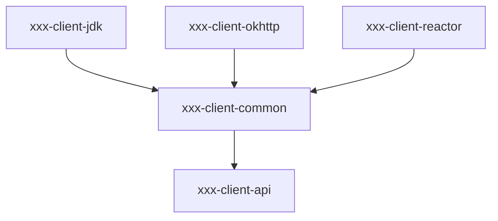

<!-- toc -->

# Java Http SDK设计

## maven模块设计

maven module命名可以叫xxx-client或者xxx-http-client，这通常取决于你的项目是否有其他协议的client，如果没有，那么推荐直接使用xxx-client。

module视图：

```
xxx-client(maven artifactId: xxx-client-parent)/
|-- xxx-client-api(接口定义，包名com.xxx.client.api，jdk8+)
|-- xxx-client-common/core(核心实现，包名com.xxx.client.common，jdk8+)
|-- xxx-client-jdk(基于jdk http client的实现，包名com.xxx.client.jdk，jdk17+)
|-- xxx-client-okhttp(基于okhttp的实现，包名com.xxx.client.okhttp，jdk8+)
|-- xxx-client-reactor(基于reactor-netty的实现，包名com.xxx.client.reactor，jdk8+)
```

依赖关系图:


