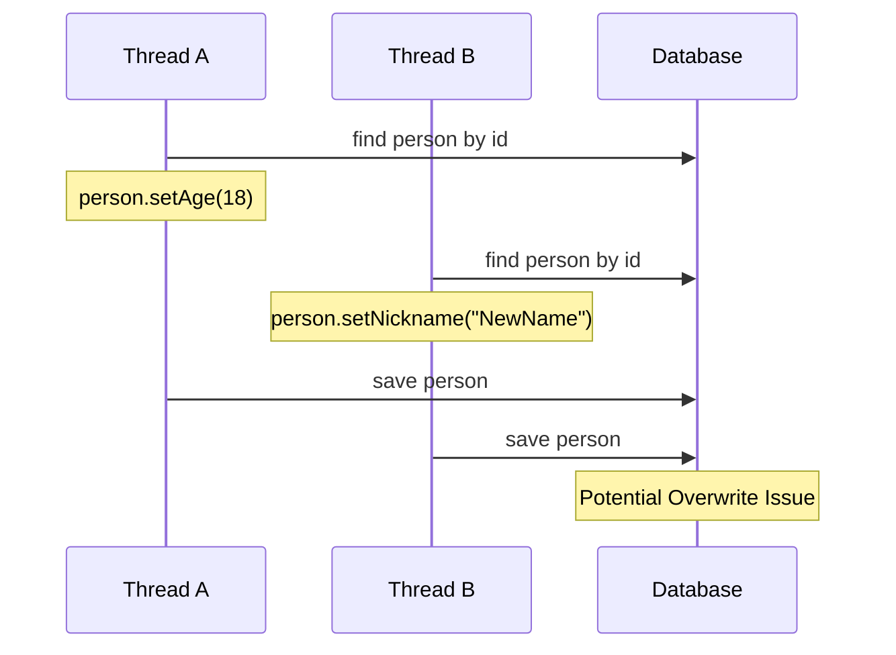

在现代应用编码中，从数据库里面find出来，进行一些业务逻辑操作，最后再save回去。即：

```java
Person person = personRepo.findById(id);
person.setAge(18);
personRepo.save(person);
```

但是这样的业务操作，如果一个线程修改年龄，另一个线程修改昵称，最后save回去，可能会导致年龄/昵称某一个的修改被覆盖。



常见的解决方案有两种

# 执行前添加悲观锁

通过分布式锁等方式，保证同一时间只有一个线程能够对数据进行修改。

# 乐观锁思路实现

版本控制是另一种流行的处理并发问题的方法。它通过在每次更新记录时递增版本号来确保数据的一致性。

这在JPA中，可以通过在field上添加`@Version`注解来实现，但这也就要求①数据库中必须有version字段，②对于查找后更新类操作，必须使用JPA的save方法来进行更新。

当然也可以通过`update_time`来模拟乐观锁实现，这可能需要你在更新的时候添加`update_time`的条件，并且，`update_time`在极端场景下，理论正确性没那么严谨。
