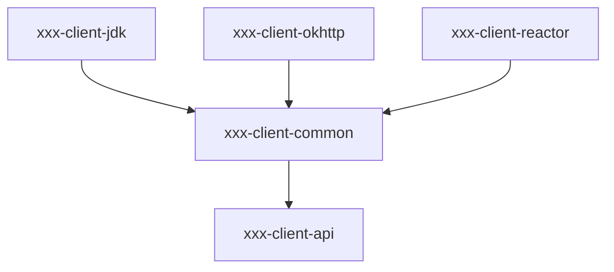

<!-- toc -->

# Java Http SDK设计

根据Java项目的需求和特性，可以为Java的Http SDK项目选择以下命名方式：

- `xxx-client-java`：如果这个项目只有Http SDK，没有其他协议的SDK，推荐使用这个命名方式。
- `xxx-http-client-java`：当存在其他协议的SDK时，可以使用这个命名方式，以区分不同协议的SDK。
- `xxx-admin-java`：当项目使用其他协议作为数据通道，使用HTTP协议作为管理通道时，可以使用这个命名方式。

## maven模块设计

maven module命名可以叫xxx-client或者xxx-http-client，这通常取决于你的项目是否有其他协议的client，如果没有，那么推荐直接使用xxx-client。

假设包名前缀为com.xxx，module视图如下:

```
xxx-client-java(maven artifactId: xxx-client-parent)/
|-- xxx-client-api(接口定义，包名com.xxx.client.api，jdk8+)
|-- xxx-client-common/core(核心实现，包名com.xxx.client.common，jdk8+)
|-- xxx-client-jdk(基于jdk http client的实现，包名com.xxx.client.jdk，jdk17+)
|-- xxx-client-okhttp(基于okhttp的实现，包名com.xxx.client.okhttp，jdk8+)
|-- xxx-client-reactor(基于reactor-netty的实现，包名com.xxx.client.reactor，jdk8+)
```

依赖关系图:


