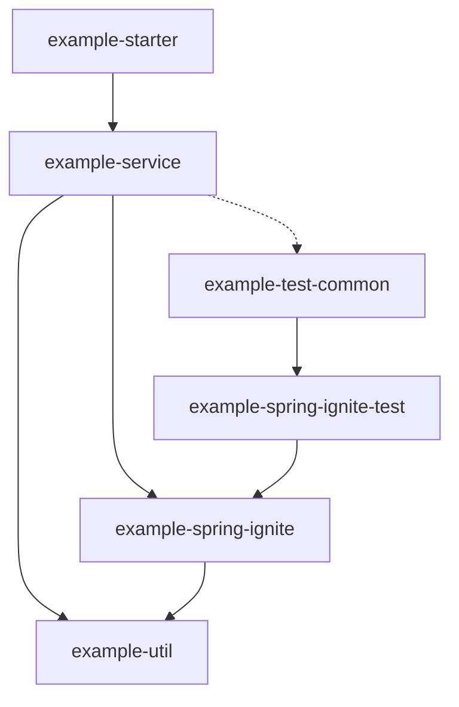
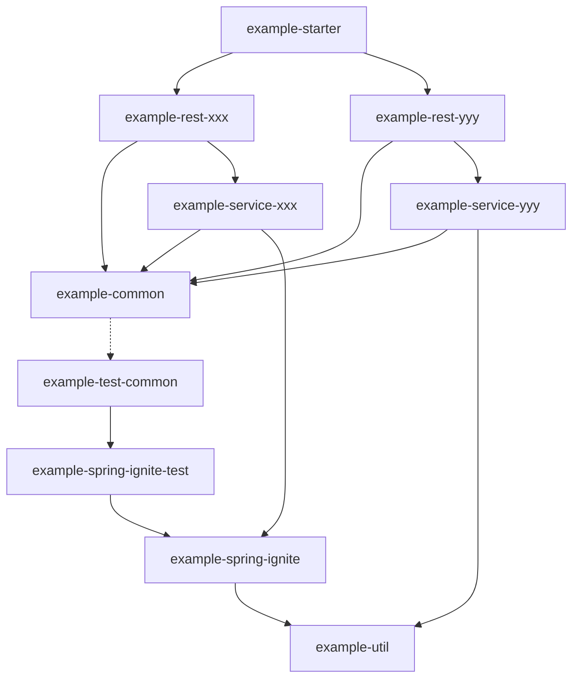

<!-- toc -->

## 简单的library

对于简单的library来说，我更推荐将所有的文件都放在同一个package下面，如简单的client封装
```
package:com.xxx.yyy/
|-- XxClient
|-- XxDTO
|-- XxException
|-- XxUtil
```

## 复杂的SpringBoot项目，负责多个业务模块

备注:
- xxx、yyy代表大块的业务区分：如用户、订单、支付
- aaa、bbb代表小块的业务区分：如(用户的)登录、注册、查询

### 方案一：多业务模块通过子包来区分，不分子module

module视图:

```
example(maven artifactId: example-parent)/
|-- example-service(业务逻辑)
|-- example-spring-ignite(依赖spring，常见为中间件client，适配spring模块用于方便单元测试)
|-- example-spring-ignite-test(依赖spring，不依赖test-common，spring模块单元测试用)
|-- example-starter(启动类)
|-- example-test-common(不依赖example-common)
|-- example-util(不依赖Spring框架，可选模块，为service与其他spring集成组件共用)
```

依赖关系图:



service包内视图:
```
io.shoothzj.example/
|-- service/
|   |-- common/
|   |-- module/
|   |   |-- aaaModule
|   |   |-- bbbModule
|   |-- mapper/
|   |   |-- aaaMapper
|   |   |-- bbbMapper
|   |-- repo/
|   |   |-- aaaRepo
|   |   |-- bbbRepo
|   |-- service/
|   |   |-- aaaService
|   |   |-- bbbService
```

### 方案二：根据业务模块拆分子module

适用于大型项目，每个业务模块都比较大。

module视图：

```
example(maven artifactId: example-parent)/
|-- example-common(可依赖spring模块)
|-- example-rest-xxx(xxx功能模块的rest接口)
|-- example-rest-yyy(yyy功能模块的rest接口)
|-- example-service-xxx(xxx功能的业务逻辑)
|-- example-service-yyy(yyy功能的业务逻辑)
|-- example-spring-ignite(依赖spring，常见为中间件client，适配spring模块用于方便单元测试)
|-- example-spring-ignite-test(依赖spring，不依赖test-common，spring模块单元测试用)
|-- example-starter(启动类)
|-- example-test-common(不依赖example-common)
|-- example-util(不依赖example-common，可选模块，为service、common与其他spring集成组件共用)
```

依赖关系图:



关于service模块引不引用rest模块的DTO，我的想法：

如果确实service模块和rest模块DTO差距比较大，可以拆分做转换，如果差距很小/没有差距，可以复用同一个DTO，放在service模块或者更底层的依赖。

service-xxx包内视图:
```
io.shoothzj.example.service/
|-- xxx/
|   |-- common/
|   |-- module/
|   |   |-- aaaModule
|   |   |-- bbbModule
|   |-- mapper/
|   |   |-- aaaMapper
|   |   |-- bbbMapper
|   |-- repo/
|   |   |-- aaaRepo
|   |   |-- bbbRepo
|   |-- service/
|   |   |-- aaaService
|   |   |-- bbbService
```
