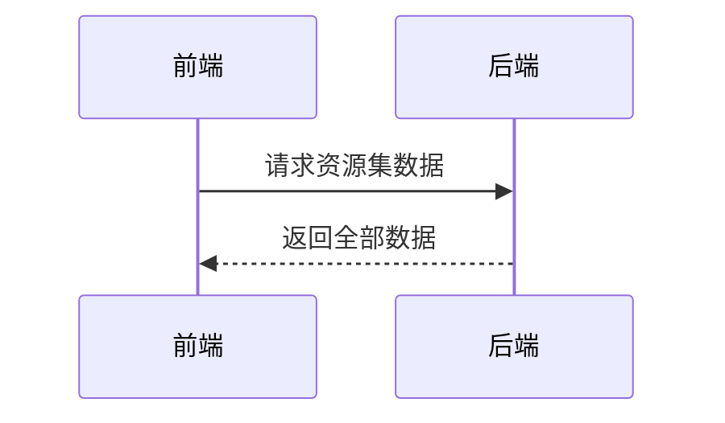
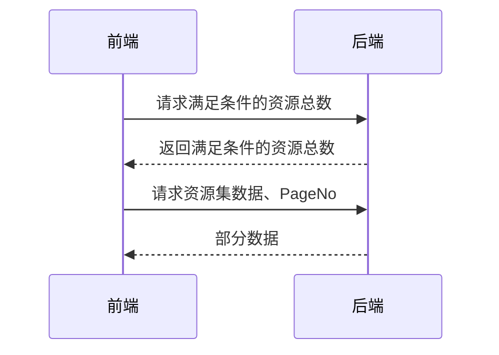
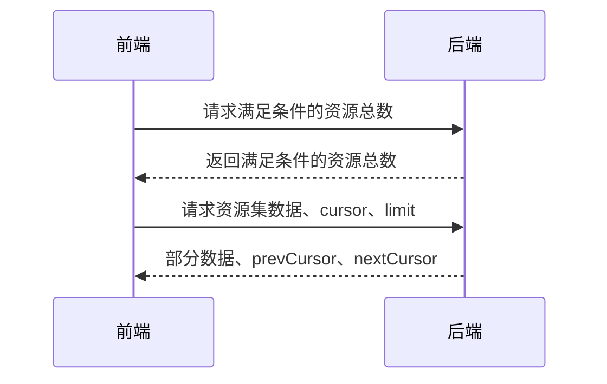

在软件开发中，分页没有统一的规范，实现方式也各不相同，有的会返回总页数，有的会返回总条数，有的可以任意翻页。本文对比一下几种常见的分页方式。

总体来说，分页的实现方案分为四种：

- 后端全部返回，由前端分页
- limit offset方案
- cursor方案
- cursor方案与offset结合

# 后端全部返回，由前端分页

| 前端功能   | 支持情况    |
|--------|---------|
| 显示总页   | 🙂      |
| 任意页码跳转 | 🙂      |
| 跳转附近数页 | 🙂      |
| 大量数据集  | 😭完全不可用 |
| 实现难度   | 简单      |

# limit offset方案

| 前端功能   | 支持情况        |
|--------|-------------|
| 显示总页   | 🙂          |
| 任意页码跳转 | 🙂          |
| 跳转附近数页 | 🙂          |
| 大量数据集  | 😭海量数据集下性能差 |
| 实现难度   | 相对简单        |

# cursor方案

| 前端功能   | 支持情况 |
|--------|------|
| 显示总页   | 🙂   |
| 任意页码跳转 | 😭   |
| 跳转附近数页 | 🙂   |
| 大量数据集  | 🙂   |
| 实现难度   | 相对复杂 |

如果每一次翻页都返回总页数的话，对性能来讲也是不小的开销。

相对动态的数据来说，如果不一直翻到没有数据为止，也不好确定是否到了最后一页。为了解决这个问题，以及跳转附近数页的问题，可以演进为这样的方案。

假定前端最多显示最近6页，每页50条数据，那么前端可以直接尝试预读300条数据，根据返回的数据来做局部的分页。一言以蔽之：读取更多的数据来进行局部分页。

这里可以再简化一下前端的实现，添加offset参数，这样子前端只需要判断当前页前后数据条数是否足够，附近页的跳转可以通过携带offset字段请求得到。

# cursor方案与offset结合

